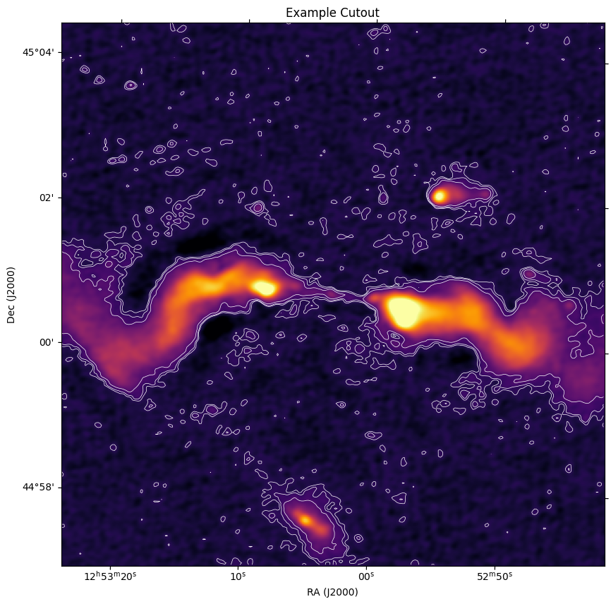

# 🌌 STRW LOFAR Data Utils

This utility package was created out of necessity when no straightforward tools existed to generate cutouts from LoTSS (LOFAR Two-metre Sky Survey) DR2 and DR3 data. It leverages the fact that most LoTSS DR2/DR3 mosaics are stored on the STRW cluster to provide fast and efficient cutout generation for any position within DR2/DR3 coverage.

Built primarily for STRW/Leiden Observatory environments.

## ✨ Features

- 📍 Generate cutouts from `(RA, Dec)` coordinates for LoTSS DR2/DR3
- 📐 Specify size in pixels or arcminutes
- ⚙️ Batch processing via a single pipeline entrypoint
- 🧭 DR2/DR3 crawler support - tile-based cutout generation
- 📚 Source catalog integration - identify which sources fall within cutouts and get their positions. Source catalog here refers to `PyBDSF`-style catalogs containing source/component positions and properties.
- 🖼️ Cutout plotting and save-to-FITS helpers

## ✅ Requirements

- Python 3.9+
- Access to LoTSS DR2/DR3 mosaic files (cluster/local mirror)

## 📦 Installation

# Step 1: Install the package (choose one of the options below)

### Option 1 (recommended for development): editable install

```bash
git clone https://github.com/Aureusa/strw_lofar_data_utils.git
cd strw_lofar_data_utils

python -m venv .venv
source .venv/bin/activate

python -m pip install --upgrade pip
python -m pip install -e .
```

With editable install, code changes are picked up immediately (no reinstall needed for normal `.py` edits).

### Option 2: standard local install

```bash
git clone https://github.com/Aureusa/strw_lofar_data_utils.git
cd strw_lofar_data_utils

python -m venv .venv
source .venv/bin/activate

python -m pip install --upgrade pip
python -m pip install .  # Non editable install
```

With non-editable install, you need to reinstall the package after making changes to the code for them to take effect.

# You are good to go! See the `examples/` directory for Jupyter notebooks demonstrating cutout generation, catalog integration, and visualization.

## 🧩 Import Paths (current)

Use the real package path:

```python
from strw_lofar_data_utils.pipelines import generate_cutouts
from strw_lofar_data_utils.core.mosaic_crawler import Crawler
from strw_lofar_data_utils.core.cutout_maker.cutout_catalogue import CutoutCatalogue
```

## 🚀 Usage
See the `examples/` directory for Jupyter notebooks demonstrating cutout generation, catalog integration, and visualization. All the main utilities in this package have been showcased in the notebooks with example code snippets and explanations.

## 🛠️ Environment Configuration

The code uses `.env` values only for cluster-specific paths/settings such as the LoTSS mosaic base directories. The repository root is detected automatically from the cloned checkout.

For STRW users, the shipped `.env` should already contain the correct values.

If you run outside STRW, update `DR2_BASE_DIR`, `DR3_BASE_DIR`, and related values in `.env` to match your local data layout. Running outside STRW is still discouraged because the codebase is tightly coupled to the STRW environment.

Because the default coverage files still live in the repository-level `data/` directory, the package currently expects you to work from a cloned checkout of this repository.

## 🗺️ First-Time Coverage File Generation (Not needed for STRW users as this is already done and the file is shipped with the package)

A precomputed coverage file is already shipped at:

- `data/mosaic_coverage/lotss_dr2_mosaic_coverage.csv`

Regenerate only if needed:

```bash
cd scripts
./get_mosaic_coverage.sh
```

## 🗂️ Project Layout

```text
strw_lofar_data_utils/
├── pyproject.toml
├── README.md
├── requirements.txt
├── data/ # precomputed files, e.g. mosaic coverage, catalogs
├── examples/ # Jupyter notebooks demonstrating usage
├── scripts/
└── strw_lofar_data_utils/
    ├── core/
    │   ├── cutout_maker/
    │   └── mosaic_crawler/
    |   └── mosaic/
    └── pipelines/
```

## 📄 License

MIT. See [LICENSE](LICENSE).
